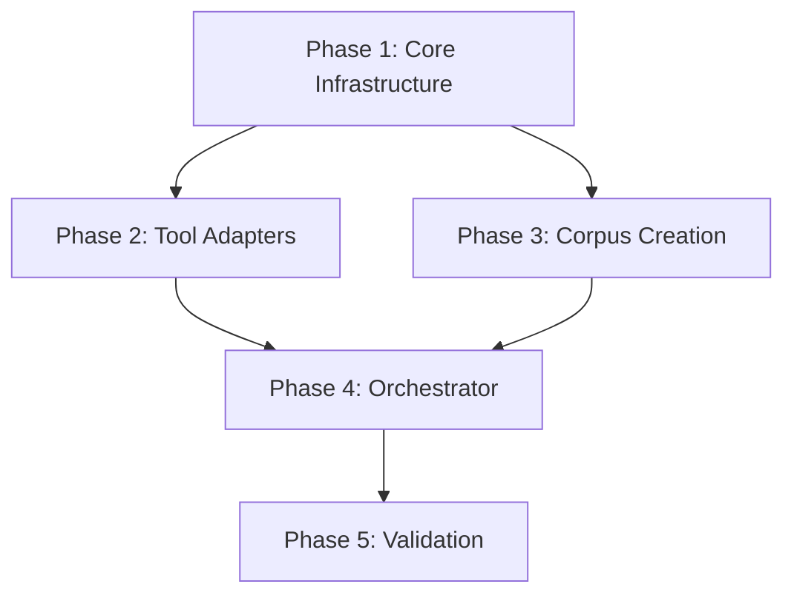

# Design Document: Realistic Code Completion Benchmark Suite

## Overview

This document specifies the technical design for a comprehensive benchmark suite that compares the HDC Sparse System against realistic code completion competitors. The benchmark focuses on tools that operate under similar constraints: local operation, minimal resources, and few-shot learning capabilities.

### Purpose

The benchmark suite addresses a critical gap in the current evaluation approach: comparing HDC against appropriate competitors that solve similar problems under similar constraints. Current benchmarks compare HDC against general-purpose language models (GPT-2, CodeGen) which target different use cases, require different infrastructure, and solve broader problems than code completion.

### Key Design Goals

1. **Fair Competition**: Compare tools with similar deployment constraints (local, offline, low resource)
2. **Realistic Tasks**: Test on structural pattern matching, template filling, and syntax-aware completion
3. **Comprehensive Metrics**: Measure accuracy, latency, memory footprint, cold start time, and scalability
4. **Extensibility**: Plugin-based architecture for adding new tools, tasks, and metrics
5. **Reproducibility**: Deterministic execution with documented dependencies and fixed datasets

### HDC System Strengths

The HDC Sparse System excels at:
- **Structural Pattern Matching**: Recognition of code syntax, templates, and idioms
- **Few-Shot Learning**: Learning from small datasets (10 examples)
- **Local/Offline Operation**: No network or cloud dependencies
- **Fast Inference**: Low latency with minimal computational requirements
- **Incremental Learning**: Continuous learning from new examples

## Architecture

### System Components


```
┌─────────────────────────────────────────────────────────────────────┐
│                     Benchmark Orchestrator                          │
│  • Task Management  • Resource Isolation  • Results Aggregation    │
└────────────┬────────────────────────────────────────────┬───────────┘
             │                                            │
             v                                            v
┌────────────────────────┐                    ┌──────────────────────┐
│   Tool Plugin System   │                    │   Metrics Collector  │
│  • Tool Registration   │                    │  • Latency           │
│  • Configuration       │                    │  • Memory            │
│  • Lifecycle Mgmt      │                    │  • Accuracy          │
└────────────┬───────────┘                    │  • Cold Start        │
             │                                └──────────────────────┘
             │
   ┌─────────┴──────────┬─────────────┬──────────────┬──────────────┐
   v                    v             v              v              v
┌────────┐      ┌──────────┐   ┌──────────┐   ┌──────────┐   ┌──────────┐
│  HDC   │      │   LSP    │   │   Tree-  │   │  TabNine │   │ Baselines│
│ System │      │ Servers  │   │  Sitter  │   │  (Local) │   │  (N-gram)│
└────────┘      └──────────┘   └──────────┘   └──────────┘   └──────────┘
                     │               │              │              │
                     └───────────────┴──────────────┴──────────────┘
                                      │
                                      v
                            ┌──────────────────┐
                            │   Code Corpus    │
                            │  • Train/Test    │
                            │  • Multi-lang    │
                            └──────────────────┘
```

### Layer Breakdown


**1. Benchmark Orchestrator**
- Manages benchmark execution lifecycle
- Isolates tool execution in separate processes/containers
- Enforces resource limits (memory, CPU, time)
- Aggregates results across all tools and tasks
- Handles errors and tool failures gracefully

**2. Tool Plugin System**
- Standardized interface for integrating completion tools
- Dynamic tool discovery and registration
- Configuration management per tool
- Process lifecycle management (start, warmup, execute, shutdown)
- Adapter pattern for heterogeneous tool APIs

**3. Metrics Collector**
- Real-time performance monitoring
- Memory profiling with tracemalloc/psutil
- Latency measurement with high-resolution timers
- Accuracy calculation with configurable metrics
- Statistical analysis and significance testing

**4. Code Corpus Manager**
- Dataset loading and validation
- Train/test split management
- Multi-language support (Python, JavaScript, TypeScript, Rust, Java)
- Task generation from corpus samples
- Reproducibility through fixed seeds and versioned datasets

### Core Workflow

1. **Initialization Phase**
   - Load configuration and corpus
   - Discover and register tool plugins
   - Validate tool availability and dependencies
   - Initialize metrics collectors

2. **Training Phase** (per tool)
   - Isolate tool in dedicated process
   - Measure memory baseline
   - Feed training examples (5/10/20/50/100 samples)
   - Measure training/indexing time
   - Capture peak memory usage


3. **Warm-up Phase** (per tool)
   - Execute practice completions
   - Allow caching/JIT compilation to stabilize
   - Discard warm-up measurements

4. **Evaluation Phase** (per tool)
   - Iterate through test tasks
   - Measure completion latency (high-resolution timer)
   - Capture completion results
   - Calculate accuracy metrics
   - Monitor memory throughout

5. **Cold Start Phase** (per tool)
   - Terminate tool process completely
   - Measure time from process start to first successful completion
   - Record cold start latency separately

6. **Analysis Phase**
   - Aggregate results across all tools
   - Calculate statistical measures (mean, median, stddev, percentiles)
   - Perform significance testing (t-test, Wilcoxon)
   - Generate comparison visualizations
   - Export results (JSON, CSV, Markdown)

## Components and Interfaces

### 1. Tool Plugin Interface

#### Abstract Base Class: `CompletionTool`

```python
from abc import ABC, abstractmethod
from dataclasses import dataclass
from typing import List, Tuple, Dict, Any, Optional

@dataclass
class CompletionRequest:
    """A single completion request"""
    context: str              # Code context before cursor
    language: str             # Programming language
    task_type: str           # 'token', 'line', 'block'
    max_tokens: int          # Maximum tokens to generate
    domain: Optional[str]    # Optional domain hint (e.g., 'stdlib', 'framework')

@dataclass
class CompletionResponse:
    """A single completion response"""
    completion: str          # Generated completion text
    confidence: float        # Confidence score (0-1)
    latency_ms: float       # Internal latency measurement
    tokens_generated: int    # Number of tokens generated
    metadata: Dict[str, Any] # Tool-specific metadata


class CompletionTool(ABC):
    """Abstract base class for all completion tools"""
    
    @property
    @abstractmethod
    def name(self) -> str:
        """Tool name for identification"""
        pass
    
    @property
    @abstractmethod
    def version(self) -> str:
        """Tool version"""
        pass
    
    @property
    @abstractmethod
    def requires_gpu(self) -> bool:
        """Whether tool requires GPU"""
        pass
    
    @property
    @abstractmethod
    def supports_incremental(self) -> bool:
        """Whether tool supports incremental learning"""
        pass
    
    @abstractmethod
    def initialize(self, config: Dict[str, Any]) -> None:
        """Initialize tool with configuration
        
        Args:
            config: Tool-specific configuration
            
        Raises:
            ToolInitializationError: If initialization fails
        """
        pass
    
    @abstractmethod
    def train(self, examples: List[Tuple[str, str]], 
              language: str) -> Dict[str, float]:
        """Train/index on examples
        
        Args:
            examples: List of (context, completion) pairs
            language: Programming language
            
        Returns:
            Dict with training metrics (time_ms, memory_mb, etc.)
        """
        pass
    
    @abstractmethod
    def complete(self, request: CompletionRequest) -> CompletionResponse:
        """Generate completion for request
        
        Args:
            request: Completion request
            
        Returns:
            Completion response
            
        Raises:
            CompletionError: If completion fails
        """
        pass
    
    @abstractmethod
    def shutdown(self) -> None:
        """Clean up resources"""
        pass
```


### 2. Specific Tool Implementations

#### HDC System Adapter

```python
class HDCCompletionTool(CompletionTool):
    """Adapter for HDC Sparse System"""
    
    def __init__(self):
        self.brain: Optional[BrainMemory] = None
        self._name = "HDC-Sparse"
        self._version = "1.0"
    
    @property
    def name(self) -> str:
        return self._name
    
    @property
    def version(self) -> str:
        return self._version
    
    @property
    def requires_gpu(self) -> bool:
        return False
    
    @property
    def supports_incremental(self) -> bool:
        return True
    
    def initialize(self, config: Dict[str, Any]) -> None:
        """Initialize BrainMemory with config"""
        window_size = config.get('window_size', 12)
        decay = config.get('decay', 0.72)
        self.brain = BrainMemory(window_size=window_size, decay=decay)
    
    def train(self, examples: List[Tuple[str, str]], 
              language: str) -> Dict[str, float]:
        """Train HDC on examples"""
        import time
        import tracemalloc
        
        tracemalloc.start()
        start_time = time.perf_counter()
        
        # Expose each training pair to the brain
        for context, completion in examples:
            self.brain.expose_pair(context, completion, domain=language)
        
        elapsed = (time.perf_counter() - start_time) * 1000
        current, peak = tracemalloc.get_traced_memory()
        tracemalloc.stop()
        
        return {
            'training_time_ms': elapsed,
            'memory_mb': peak / (1024 * 1024),
            'examples_count': len(examples)
        }
    
    def complete(self, request: CompletionRequest) -> CompletionResponse:
        """Generate completion using HDC"""
        import time
        
        start_time = time.perf_counter()
        
        result = self.brain.generate(
            request.context,
            max_new_tokens=request.max_tokens,
            domain=request.language
        )
        
        latency = (time.perf_counter() - start_time) * 1000
        
        # Handle result being tuple or string
        if isinstance(result, tuple):
            completion_text = result[0] if result else ""
            confidence = result[1] if len(result) > 1 else 0.5
        else:
            completion_text = str(result)
            confidence = 0.5
        
        return CompletionResponse(
            completion=completion_text,
            confidence=confidence,
            latency_ms=latency,
            tokens_generated=len(completion_text.split()),
            metadata={'method': 'hdc_generation'}
        )
    
    def shutdown(self) -> None:
        """Clean up HDC resources"""
        self.brain = None
```


#### LSP Server Adapter

```python
class LSPCompletionTool(CompletionTool):
    """Adapter for LSP servers (pyright, rust-analyzer, typescript-language-server)"""
    
    def __init__(self, lsp_command: str, language: str):
        self.lsp_command = lsp_command
        self.language = language
        self.process: Optional[subprocess.Popen] = None
        self.lsp_client: Optional[LanguageClient] = None
        self._name = f"LSP-{language}"
        self._version = "1.0"
        self.workspace_path: Optional[Path] = None
    
    @property
    def name(self) -> str:
        return self._name
    
    @property
    def version(self) -> str:
        return self._version
    
    @property
    def requires_gpu(self) -> bool:
        return False
    
    @property
    def supports_incremental(self) -> bool:
        return True  # LSP supports incremental updates
    
    def initialize(self, config: Dict[str, Any]) -> None:
        """Start LSP server and establish connection"""
        import subprocess
        from pathlib import Path
        
        # Create temporary workspace
        self.workspace_path = Path(config.get('workspace', '.')) / f'lsp_workspace_{self.language}'
        self.workspace_path.mkdir(parents=True, exist_ok=True)
        
        # Start LSP server
        self.process = subprocess.Popen(
            self.lsp_command.split(),
            stdin=subprocess.PIPE,
            stdout=subprocess.PIPE,
            stderr=subprocess.PIPE,
            cwd=str(self.workspace_path)
        )
        
        # Initialize LSP client protocol
        self.lsp_client = LanguageClient(
            stdin=self.process.stdin,
            stdout=self.process.stdout
        )
        
        # Send initialize request
        self.lsp_client.initialize(
            root_uri=f'file://{self.workspace_path.absolute()}',
            capabilities={}
        )
    
    def train(self, examples: List[Tuple[str, str]], 
              language: str) -> Dict[str, float]:
        """Index examples by creating files in workspace"""
        import time
        
        start_time = time.perf_counter()
        
        # Create source files from examples
        for idx, (context, completion) in enumerate(examples):
            file_ext = self._get_file_extension(language)
            file_path = self.workspace_path / f'example_{idx}.{file_ext}'
            
            # Write full code to file
            full_code = context + completion
            file_path.write_text(full_code)
            
            # Notify LSP of new file
            self.lsp_client.did_open(
                uri=f'file://{file_path.absolute()}',
                language_id=language,
                text=full_code
            )
        
        # Wait for LSP to index
        time.sleep(0.5)  # Give LSP time to process
        
        elapsed = (time.perf_counter() - start_time) * 1000
        
        return {
            'training_time_ms': elapsed,
            'memory_mb': 0,  # Measured externally
            'examples_count': len(examples),
            'files_created': len(examples)
        }
    
    def complete(self, request: CompletionRequest) -> CompletionResponse:
        """Request completion from LSP server"""
        import time
        
        # Create temporary file with context
        file_ext = self._get_file_extension(request.language)
        temp_file = self.workspace_path / f'temp_completion.{file_ext}'
        temp_file.write_text(request.context)
        
        # Determine cursor position (end of context)
        lines = request.context.split('\n')
        line = len(lines) - 1
        character = len(lines[-1])
        
        start_time = time.perf_counter()
        
        # Request completion
        completions = self.lsp_client.text_document_completion(
            uri=f'file://{temp_file.absolute()}',
            line=line,
            character=character
        )
        
        latency = (time.perf_counter() - start_time) * 1000
        
        # Extract best completion
        if completions and len(completions) > 0:
            best = completions[0]
            completion_text = best.get('insertText', best.get('label', ''))
            confidence = 1.0 / (1 + completions.index(best))  # Rank-based confidence
        else:
            completion_text = ""
            confidence = 0.0
        
        return CompletionResponse(
            completion=completion_text,
            confidence=confidence,
            latency_ms=latency,
            tokens_generated=len(completion_text.split()),
            metadata={
                'method': 'lsp_completion',
                'total_suggestions': len(completions) if completions else 0
            }
        )
    
    def shutdown(self) -> None:
        """Terminate LSP server"""
        if self.lsp_client:
            self.lsp_client.shutdown()
        if self.process:
            self.process.terminate()
            self.process.wait(timeout=5)
        # Clean up workspace
        if self.workspace_path and self.workspace_path.exists():
            import shutil
            shutil.rmtree(self.workspace_path)
    
    @staticmethod
    def _get_file_extension(language: str) -> str:
        """Map language to file extension"""
        extensions = {
            'python': 'py',
            'javascript': 'js',
            'typescript': 'ts',
            'rust': 'rs',
            'java': 'java',
            'csharp': 'cs'
        }
        return extensions.get(language.lower(), 'txt')
```


#### Tree-Sitter Adapter

```python
class TreeSitterCompletionTool(CompletionTool):
    """Adapter for tree-sitter based completion"""
    
    def __init__(self, language: str):
        self.language = language
        self.parser: Optional[Any] = None
        self.pattern_index: Dict[str, List[str]] = {}
        self._name = f"TreeSitter-{language}"
        self._version = "1.0"
    
    @property
    def name(self) -> str:
        return self._name
    
    @property
    def version(self) -> str:
        return self._version
    
    @property
    def requires_gpu(self) -> bool:
        return False
    
    @property
    def supports_incremental(self) -> bool:
        return True
    
    def initialize(self, config: Dict[str, Any]) -> None:
        """Initialize tree-sitter parser for language"""
        import tree_sitter
        
        # Load language grammar
        language_lib = config.get('language_lib', None)
        if not language_lib:
            raise ToolInitializationError(f"No language_lib specified for {self.language}")
        
        # Create parser
        self.parser = tree_sitter.Parser()
        lang = tree_sitter.Language(language_lib, self.language)
        self.parser.set_language(lang)
    
    def train(self, examples: List[Tuple[str, str]], 
              language: str) -> Dict[str, float]:
        """Build pattern index from examples"""
        import time
        
        start_time = time.perf_counter()
        
        for context, completion in examples:
            # Parse context to extract syntax tree
            tree = self.parser.parse(bytes(context, 'utf8'))
            
            # Extract patterns from tree
            patterns = self._extract_patterns(tree.root_node)
            
            # Index completion by patterns
            for pattern in patterns:
                if pattern not in self.pattern_index:
                    self.pattern_index[pattern] = []
                self.pattern_index[pattern].append(completion)
        
        elapsed = (time.perf_counter() - start_time) * 1000
        
        return {
            'training_time_ms': elapsed,
            'memory_mb': 0,  # Measured externally
            'examples_count': len(examples),
            'patterns_indexed': len(self.pattern_index)
        }
    
    def complete(self, request: CompletionRequest) -> CompletionResponse:
        """Generate completion based on syntax tree patterns"""
        import time
        
        start_time = time.perf_counter()
        
        # Parse context
        tree = self.parser.parse(bytes(request.context, 'utf8'))
        
        # Extract patterns from context
        patterns = self._extract_patterns(tree.root_node)
        
        # Find best matching completion
        completion_text = ""
        confidence = 0.0
        
        for pattern in reversed(patterns):  # Most specific first
            if pattern in self.pattern_index:
                completions = self.pattern_index[pattern]
                completion_text = completions[0]  # Take first indexed completion
                confidence = 1.0 / len(completions)  # Confidence based on # matches
                break
        
        latency = (time.perf_counter() - start_time) * 1000
        
        return CompletionResponse(
            completion=completion_text,
            confidence=confidence,
            latency_ms=latency,
            tokens_generated=len(completion_text.split()),
            metadata={
                'method': 'tree_sitter_pattern_match',
                'patterns_matched': len([p for p in patterns if p in self.pattern_index])
            }
        )
    
    def shutdown(self) -> None:
        """Clean up resources"""
        self.parser = None
        self.pattern_index.clear()
    
    def _extract_patterns(self, node) -> List[str]:
        """Extract syntax patterns from tree node"""
        patterns = []
        
        # Add node type
        patterns.append(node.type)
        
        # Add parent-child pattern
        if node.parent:
            patterns.append(f"{node.parent.type}>{node.type}")
        
        # Add sibling pattern
        if node.prev_sibling:
            patterns.append(f"{node.prev_sibling.type}+{node.type}")
        
        # Recurse for children
        for child in node.children:
            patterns.extend(self._extract_patterns(child))
        
        return patterns
```


#### Baseline N-Gram Tool

```python
class NGramCompletionTool(CompletionTool):
    """Baseline n-gram completion model"""
    
    def __init__(self, n: int = 3):
        self.n = n
        self.model: Dict[Tuple[str, ...], Counter] = defaultdict(Counter)
        self._name = f"NGram-{n}"
        self._version = "1.0"
    
    @property
    def name(self) -> str:
        return self._name
    
    @property
    def version(self) -> str:
        return self._version
    
    @property
    def requires_gpu(self) -> bool:
        return False
    
    @property
    def supports_incremental(self) -> bool:
        return True
    
    def initialize(self, config: Dict[str, Any]) -> None:
        """Initialize n-gram model"""
        pass  # No initialization needed
    
    def train(self, examples: List[Tuple[str, str]], 
              language: str) -> Dict[str, float]:
        """Build n-gram model from examples"""
        import time
        
        start_time = time.perf_counter()
        
        for context, completion in examples:
            full_text = context + " " + completion
            tokens = full_text.split()
            
            # Build n-grams
            for i in range(len(tokens) - self.n):
                context_ngram = tuple(tokens[i:i+self.n])
                next_token = tokens[i+self.n]
                self.model[context_ngram][next_token] += 1
        
        elapsed = (time.perf_counter() - start_time) * 1000
        
        return {
            'training_time_ms': elapsed,
            'memory_mb': 0,  # Measured externally
            'examples_count': len(examples),
            'ngrams_count': len(self.model)
        }
    
    def complete(self, request: CompletionRequest) -> CompletionResponse:
        """Generate completion using n-gram model"""
        import time
        
        start_time = time.perf_counter()
        
        tokens = request.context.split()
        result_tokens = []
        
        for _ in range(request.max_tokens):
            # Get last n tokens as context
            context = tuple(tokens[-(self.n):])
            
            if context in self.model and self.model[context]:
                # Pick most common next token
                next_token = self.model[context].most_common(1)[0][0]
                result_tokens.append(next_token)
                tokens.append(next_token)
            else:
                break
        
        latency = (time.perf_counter() - start_time) * 1000
        completion_text = ' '.join(result_tokens)
        
        return CompletionResponse(
            completion=completion_text,
            confidence=0.5,
            latency_ms=latency,
            tokens_generated=len(result_tokens),
            metadata={'method': f'{self.n}-gram'}
        )
    
    def shutdown(self) -> None:
        """Clean up resources"""
        self.model.clear()
```


### 3. Task Manager

```python
@dataclass
class CompletionTask:
    """A single completion task"""
    task_id: str
    language: str
    task_type: str  # 'token', 'line', 'block', 'structural', 'template'
    context: str
    expected_completion: str
    metadata: Dict[str, Any]

class TaskManager:
    """Manages benchmark tasks and evaluation"""
    
    def __init__(self, corpus_path: str):
        self.corpus_path = Path(corpus_path)
        self.tasks: List[CompletionTask] = []
        self.train_examples: Dict[str, List[Tuple[str, str]]] = {}
    
    def load_corpus(self, languages: List[str]) -> None:
        """Load code corpus and create tasks"""
        for lang in languages:
            lang_corpus = self.corpus_path / lang
            if not lang_corpus.exists():
                raise ValueError(f"Corpus not found for {lang}")
            
            # Load training examples
            train_file = lang_corpus / 'train.jsonl'
            self.train_examples[lang] = self._load_examples(train_file)
            
            # Load test tasks
            test_file = lang_corpus / 'test.jsonl'
            self.tasks.extend(self._load_tasks(test_file, lang))
    
    def _load_examples(self, file_path: Path) -> List[Tuple[str, str]]:
        """Load training examples from file"""
        import json
        examples = []
        with open(file_path, 'r') as f:
            for line in f:
                data = json.loads(line)
                examples.append((data['context'], data['completion']))
        return examples
    
    def _load_tasks(self, file_path: Path, language: str) -> List[CompletionTask]:
        """Load test tasks from file"""
        import json
        tasks = []
        with open(file_path, 'r') as f:
            for idx, line in enumerate(f):
                data = json.loads(line)
                task = CompletionTask(
                    task_id=f"{language}_{idx}",
                    language=language,
                    task_type=data['task_type'],
                    context=data['context'],
                    expected_completion=data['completion'],
                    metadata=data.get('metadata', {})
                )
                tasks.append(task)
        return tasks
    
    def get_train_examples(self, language: str, 
                          count: int = 10) -> List[Tuple[str, str]]:
        """Get training examples for language"""
        examples = self.train_examples.get(language, [])
        return examples[:count]
    
    def get_test_tasks(self, language: Optional[str] = None,
                       task_type: Optional[str] = None) -> List[CompletionTask]:
        """Get filtered test tasks"""
        tasks = self.tasks
        
        if language:
            tasks = [t for t in tasks if t.language == language]
        
        if task_type:
            tasks = [t for t in tasks if t.task_type == task_type]
        
        return tasks
```


### 4. Metrics Collector

```python
@dataclass
class ToolMetrics:
    """Comprehensive metrics for a tool"""
    tool_name: str
    
    # Accuracy metrics
    exact_match_accuracy: float
    token_accuracy: float
    edit_distance_avg: float
    top_k_accuracy: Dict[int, float]  # k -> accuracy
    
    # Performance metrics
    inference_latency_ms: Dict[str, float]  # mean, median, p95, p99
    training_time_ms: float
    cold_start_time_ms: float
    
    # Resource metrics
    memory_peak_mb: float
    memory_avg_mb: float
    disk_space_mb: float
    
    # Capability metrics
    requires_gpu: bool
    supports_incremental: bool
    offline_capable: bool
    
    # Task-specific breakdown
    accuracy_by_task_type: Dict[str, float]
    accuracy_by_language: Dict[str, float]
    latency_by_task_type: Dict[str, float]
    
    # Scaling metrics
    training_time_by_dataset_size: Dict[int, float]
    accuracy_by_dataset_size: Dict[int, float]

class MetricsCollector:
    """Collects and analyzes benchmark metrics"""
    
    def __init__(self):
        self.results: Dict[str, ToolMetrics] = {}
        self.raw_results: List[Dict[str, Any]] = []
    
    def record_completion(self, tool_name: str, task: CompletionTask,
                         response: CompletionResponse) -> None:
        """Record a single completion result"""
        result = {
            'tool': tool_name,
            'task_id': task.task_id,
            'language': task.language,
            'task_type': task.task_type,
            'expected': task.expected_completion,
            'actual': response.completion,
            'latency_ms': response.latency_ms,
            'confidence': response.confidence,
            'tokens_generated': response.tokens_generated
        }
        self.raw_results.append(result)
    
    def calculate_metrics(self, tool_name: str) -> ToolMetrics:
        """Calculate comprehensive metrics for a tool"""
        tool_results = [r for r in self.raw_results if r['tool'] == tool_name]
        
        if not tool_results:
            raise ValueError(f"No results for tool {tool_name}")
        
        # Calculate accuracy metrics
        exact_matches = sum(1 for r in tool_results 
                          if r['actual'] == r['expected'])
        exact_match_accuracy = exact_matches / len(tool_results)
        
        token_accuracy = self._calculate_token_accuracy(tool_results)
        edit_distance_avg = self._calculate_avg_edit_distance(tool_results)
        top_k_accuracy = self._calculate_top_k_accuracy(tool_results)
        
        # Calculate performance metrics
        latencies = [r['latency_ms'] for r in tool_results]
        inference_latency_ms = {
            'mean': np.mean(latencies),
            'median': np.median(latencies),
            'std': np.std(latencies),
            'p95': np.percentile(latencies, 95),
            'p99': np.percentile(latencies, 99)
        }
        
        # Calculate task-specific breakdowns
        accuracy_by_task_type = self._group_accuracy_by(tool_results, 'task_type')
        accuracy_by_language = self._group_accuracy_by(tool_results, 'language')
        latency_by_task_type = self._group_latency_by(tool_results, 'task_type')
        
        return ToolMetrics(
            tool_name=tool_name,
            exact_match_accuracy=exact_match_accuracy,
            token_accuracy=token_accuracy,
            edit_distance_avg=edit_distance_avg,
            top_k_accuracy=top_k_accuracy,
            inference_latency_ms=inference_latency_ms,
            training_time_ms=0.0,  # Set separately
            cold_start_time_ms=0.0,  # Set separately
            memory_peak_mb=0.0,  # Set separately
            memory_avg_mb=0.0,  # Set separately
            disk_space_mb=0.0,  # Set separately
            requires_gpu=False,  # Set from tool properties
            supports_incremental=False,  # Set from tool properties
            offline_capable=False,  # Set from tool properties
            accuracy_by_task_type=accuracy_by_task_type,
            accuracy_by_language=accuracy_by_language,
            latency_by_task_type=latency_by_task_type,
            training_time_by_dataset_size={},  # Populated during scaling tests
            accuracy_by_dataset_size={}  # Populated during scaling tests
        )
    
    def _calculate_token_accuracy(self, results: List[Dict]) -> float:
        """Calculate token-level accuracy"""
        total_tokens = 0
        correct_tokens = 0
        
        for r in results:
            expected_tokens = r['expected'].split()
            actual_tokens = r['actual'].split()
            
            for i in range(min(len(expected_tokens), len(actual_tokens))):
                total_tokens += 1
                if expected_tokens[i] == actual_tokens[i]:
                    correct_tokens += 1
        
        return correct_tokens / total_tokens if total_tokens > 0 else 0.0
    
    def _calculate_avg_edit_distance(self, results: List[Dict]) -> float:
        """Calculate average Levenshtein edit distance"""
        from Levenshtein import distance
        distances = [distance(r['expected'], r['actual']) for r in results]
        return np.mean(distances)
    
    def _calculate_top_k_accuracy(self, results: List[Dict]) -> Dict[int, float]:
        """Calculate top-k accuracy (for tools that provide multiple suggestions)"""
        # Simplified: just report exact match for k=1
        return {1: sum(1 for r in results if r['actual'] == r['expected']) / len(results)}
    
    def _group_accuracy_by(self, results: List[Dict], key: str) -> Dict[str, float]:
        """Group accuracy by a key (task_type or language)"""
        from collections import defaultdict
        groups = defaultdict(list)
        
        for r in results:
            groups[r[key]].append(r['actual'] == r['expected'])
        
        return {k: sum(v) / len(v) for k, v in groups.items()}
    
    def _group_latency_by(self, results: List[Dict], key: str) -> Dict[str, float]:
        """Group latency by a key"""
        from collections import defaultdict
        groups = defaultdict(list)
        
        for r in results:
            groups[r[key]].append(r['latency_ms'])
        
        return {k: np.mean(v) for k, v in groups.items()}
```


### 5. Benchmark Orchestrator

```python
class BenchmarkOrchestrator:
    """Main orchestrator for benchmark execution"""
    
    def __init__(self, config: Dict[str, Any]):
        self.config = config
        self.task_manager = TaskManager(config['corpus_path'])
        self.metrics_collector = MetricsCollector()
        self.tools: List[CompletionTool] = []
        self.results: Dict[str, ToolMetrics] = {}
    
    def register_tool(self, tool: CompletionTool) -> None:
        """Register a tool for benchmarking"""
        self.tools.append(tool)
    
    def run_benchmark(self) -> Dict[str, Any]:
        """Execute complete benchmark suite"""
        print("=" * 80)
        print("STARTING REALISTIC CODE COMPLETION BENCHMARK")
        print("=" * 80)
        
        # Load corpus
        languages = self.config.get('languages', ['python', 'javascript'])
        self.task_manager.load_corpus(languages)
        
        # Run benchmarks for each tool
        for tool in self.tools:
            print(f"\n{'=' * 80}")
            print(f"BENCHMARKING: {tool.name}")
            print(f"{'=' * 80}")
            
            try:
                self._benchmark_tool(tool)
            except Exception as e:
                print(f"❌ Tool {tool.name} failed: {e}")
                traceback.print_exc()
                continue
        
        # Generate results
        results = self._generate_results()
        
        # Save results
        self._save_results(results)
        
        return results
    
    def _benchmark_tool(self, tool: CompletionTool) -> None:
        """Benchmark a single tool"""
        import tracemalloc
        
        # Initialize tool
        print(f"Initializing {tool.name}...")
        tool.initialize(self.config.get('tool_config', {}).get(tool.name, {}))
        
        # Test dataset sizes
        dataset_sizes = self.config.get('dataset_sizes', [10])
        
        for size in dataset_sizes:
            print(f"\nTesting with {size} training examples...")
            
            # Training phase
            tracemalloc.start()
            mem_before = tracemalloc.get_traced_memory()[0]
            
            for language in self.config.get('languages', ['python']):
                train_examples = self.task_manager.get_train_examples(language, size)
                train_metrics = tool.train(train_examples, language)
                
                print(f"  {language}: trained in {train_metrics['training_time_ms']:.2f}ms")
            
            mem_peak = tracemalloc.get_traced_memory()[1]
            tracemalloc.stop()
            memory_mb = (mem_peak - mem_before) / (1024 * 1024)
            
            # Warm-up phase
            print("  Warming up...")
            warmup_tasks = self.task_manager.get_test_tasks()[:3]
            for task in warmup_tasks:
                request = CompletionRequest(
                    context=task.context,
                    language=task.language,
                    task_type=task.task_type,
                    max_tokens=10
                )
                _ = tool.complete(request)
            
            # Evaluation phase
            print("  Evaluating...")
            test_tasks = self.task_manager.get_test_tasks()
            
            for task in test_tasks:
                request = CompletionRequest(
                    context=task.context,
                    language=task.language,
                    task_type=task.task_type,
                    max_tokens=10
                )
                
                try:
                    response = tool.complete(request)
                    self.metrics_collector.record_completion(
                        f"{tool.name}_size{size}", task, response
                    )
                except Exception as e:
                    print(f"    ⚠️  Task {task.task_id} failed: {e}")
            
            # Calculate metrics
            metrics = self.metrics_collector.calculate_metrics(f"{tool.name}_size{size}")
            metrics.memory_peak_mb = memory_mb
            metrics.requires_gpu = tool.requires_gpu
            metrics.supports_incremental = tool.supports_incremental
            
            self.results[f"{tool.name}_size{size}"] = metrics
            
            # Print summary
            print(f"  Accuracy: {metrics.exact_match_accuracy * 100:.1f}%")
            print(f"  Latency: {metrics.inference_latency_ms['mean']:.2f}ms")
            print(f"  Memory: {metrics.memory_peak_mb:.2f}MB")
        
        # Cold start test
        print("\nTesting cold start...")
        tool.shutdown()
        
        start_time = time.perf_counter()
        tool.initialize(self.config.get('tool_config', {}).get(tool.name, {}))
        
        # Re-train with minimal examples
        for language in self.config.get('languages', ['python']):
            train_examples = self.task_manager.get_train_examples(language, 10)
            tool.train(train_examples, language)
        
        # First completion
        test_task = self.task_manager.get_test_tasks()[0]
        request = CompletionRequest(
            context=test_task.context,
            language=test_task.language,
            task_type=test_task.task_type,
            max_tokens=10
        )
        _ = tool.complete(request)
        
        cold_start_ms = (time.perf_counter() - start_time) * 1000
        print(f"  Cold start: {cold_start_ms:.2f}ms")
        
        # Update metrics with cold start
        for key in self.results:
            if key.startswith(tool.name):
                self.results[key].cold_start_time_ms = cold_start_ms
        
        # Cleanup
        tool.shutdown()
    
    def _generate_results(self) -> Dict[str, Any]:
        """Generate comprehensive results report"""
        results = {
            'summary': self._generate_summary(),
            'comparison_table': self._generate_comparison_table(),
            'statistical_analysis': self._generate_statistical_analysis(),
            'tool_metrics': {k: asdict(v) for k, v in self.results.items()}
        }
        return results
    
    def _generate_summary(self) -> Dict[str, Any]:
        """Generate executive summary"""
        summary = {
            'total_tools': len(set(k.split('_size')[0] for k in self.results.keys())),
            'total_tasks': len(self.task_manager.tasks),
            'languages_tested': list(set(t.language for t in self.task_manager.tasks)),
            'best_accuracy': max(m.exact_match_accuracy for m in self.results.values()),
            'fastest_inference': min(m.inference_latency_ms['mean'] for m in self.results.values()),
            'lowest_memory': min(m.memory_peak_mb for m in self.results.values())
        }
        return summary
    
    def _generate_comparison_table(self) -> str:
        """Generate markdown comparison table"""
        lines = ["| Tool | Accuracy | Latency (ms) | Memory (MB) | Cold Start (ms) | Incremental |"]
        lines.append("|------|----------|--------------|-------------|-----------------|-------------|")
        
        for tool_name, metrics in self.results.items():
            lines.append(
                f"| {tool_name} | "
                f"{metrics.exact_match_accuracy * 100:.1f}% | "
                f"{metrics.inference_latency_ms['mean']:.2f} | "
                f"{metrics.memory_peak_mb:.2f} | "
                f"{metrics.cold_start_time_ms:.2f} | "
                f"{'Yes' if metrics.supports_incremental else 'No'} |"
            )
        
        return "\n".join(lines)
    
    def _generate_statistical_analysis(self) -> Dict[str, Any]:
        """Perform statistical analysis on results"""
        from scipy import stats
        
        # Compare HDC against each competitor
        hdc_results = [k for k in self.results.keys() if 'HDC' in k]
        if not hdc_results:
            return {}
        
        hdc_key = hdc_results[0]
        hdc_metrics = self.results[hdc_key]
        
        comparisons = {}
        for tool_name, metrics in self.results.items():
            if tool_name == hdc_key:
                continue
            
            # T-test for accuracy difference
            # (simplified - would need raw per-task results for proper test)
            comparisons[tool_name] = {
                'accuracy_diff': metrics.exact_match_accuracy - hdc_metrics.exact_match_accuracy,
                'latency_diff': metrics.inference_latency_ms['mean'] - hdc_metrics.inference_latency_ms['mean'],
                'memory_diff': metrics.memory_peak_mb - hdc_metrics.memory_peak_mb
            }
        
        return comparisons
    
    def _save_results(self, results: Dict[str, Any]) -> None:
        """Save results to files"""
        import json
        from datetime import datetime
        
        timestamp = datetime.now().strftime('%Y%m%d_%H%M%S')
        
        # Save JSON
        json_path = f'benchmark_results_{timestamp}.json'
        with open(json_path, 'w') as f:
            json.dump(results, f, indent=2)
        
        # Save markdown report
        md_path = f'benchmark_report_{timestamp}.md'
        with open(md_path, 'w') as f:
            f.write("# Realistic Code Completion Benchmark Report\n\n")
            f.write(f"**Generated:** {datetime.now().isoformat()}\n\n")
            f.write("## Summary\n\n")
            f.write(f"- Total tools: {results['summary']['total_tools']}\n")
            f.write(f"- Total tasks: {results['summary']['total_tasks']}\n")
            f.write(f"- Languages: {', '.join(results['summary']['languages_tested'])}\n\n")
            f.write("## Comparison\n\n")
            f.write(results['comparison_table'])
            f.write("\n\n")
        
        print(f"\n✅ Results saved:")
        print(f"   - {json_path}")
        print(f"   - {md_path}")
```


## Data Models

### Core Data Structures

#### Task Definition

```python
@dataclass
class CompletionTask:
    """A code completion task"""
    task_id: str                    # Unique identifier
    language: str                   # Programming language (python, javascript, etc.)
    task_type: str                  # token/line/block/structural/template
    context: str                    # Code context before cursor
    expected_completion: str        # Ground truth completion
    metadata: Dict[str, Any]        # Additional metadata (difficulty, domain, etc.)
    
    # Metadata fields:
    # - difficulty: 'easy', 'medium', 'hard'
    # - domain: 'stdlib', 'framework', 'algorithm', etc.
    # - pattern: 'function_def', 'class_def', 'import', 'loop', etc.
    # - tokens_count: number of tokens in expected completion
```

#### Training Example

```python
@dataclass
class TrainingExample:
    """A single training example"""
    context: str                    # Input context
    completion: str                 # Target completion
    language: str                   # Programming language
    source: str                     # Source file/project
    metadata: Dict[str, Any]        # Additional information
```

#### Completion Request/Response

Already defined in Components section above.


#### Results Structures

```python
@dataclass
class CompletionResult:
    """Result of a single completion"""
    tool_name: str
    task_id: str
    request: CompletionRequest
    response: CompletionResponse
    expected: str
    correct: bool
    token_accuracy: float
    edit_distance: int
    timestamp: float

@dataclass
class ToolMetrics:
    """Comprehensive metrics for a tool"""
    # Already defined in Components section
    pass

@dataclass
class BenchmarkResults:
    """Complete benchmark results"""
    timestamp: str
    config: Dict[str, Any]
    tools_tested: List[str]
    languages: List[str]
    total_tasks: int
    
    # Per-tool metrics
    tool_metrics: Dict[str, ToolMetrics]
    
    # Raw results
    completion_results: List[CompletionResult]
    
    # Summary statistics
    summary: Dict[str, Any]
    
    # Statistical comparisons
    statistical_analysis: Dict[str, Any]
```

### Corpus Structure

The code corpus is organized as follows:

```
corpus/
├── python/
│   ├── train.jsonl         # Training examples
│   ├── test.jsonl          # Test tasks
│   └── metadata.json       # Corpus metadata
├── javascript/
│   ├── train.jsonl
│   ├── test.jsonl
│   └── metadata.json
├── typescript/
│   ├── train.jsonl
│   ├── test.jsonl
│   └── metadata.json
├── rust/
│   ├── train.jsonl
│   ├── test.jsonl
│   └── metadata.json
└── java/
    ├── train.jsonl
    ├── test.jsonl
    └── metadata.json
```

#### JSONL Format

Each line in train.jsonl:
```json
{
  "context": "def add(a, b):",
  "completion": "return a + b",
  "language": "python",
  "source": "project_name/file.py",
  "metadata": {
    "pattern": "function_def",
    "difficulty": "easy",
    "domain": "basic_ops"
  }
}
```

Each line in test.jsonl:
```json
{
  "task_id": "python_001",
  "context": "def multiply(x, y):",
  "completion": "return x * y",
  "task_type": "line",
  "language": "python",
  "metadata": {
    "pattern": "function_def",
    "difficulty": "easy",
    "domain": "basic_ops",
    "tokens_count": 3
  }
}
```


## Error Handling

### Error Categories

1. **Tool Initialization Errors**
   - Missing dependencies
   - Invalid configuration
   - Unavailable resources

2. **Training/Indexing Errors**
   - Invalid training data
   - Out of memory
   - Timeout

3. **Completion Errors**
   - Invalid request
   - Tool crash
   - Timeout

4. **Resource Limit Errors**
   - Memory exceeded
   - Time exceeded
   - Disk space exceeded

### Error Handling Strategy

```python
class BenchmarkError(Exception):
    """Base exception for benchmark errors"""
    pass

class ToolInitializationError(BenchmarkError):
    """Tool failed to initialize"""
    pass

class TrainingError(BenchmarkError):
    """Training/indexing failed"""
    pass

class CompletionError(BenchmarkError):
    """Completion request failed"""
    pass

class ResourceLimitError(BenchmarkError):
    """Resource limit exceeded"""
    pass

# Error handling in orchestrator
def _benchmark_tool(self, tool: CompletionTool) -> None:
    """Benchmark a single tool with comprehensive error handling"""
    
    try:
        # Initialize with timeout
        with timeout(seconds=60):
            tool.initialize(config)
    except TimeoutError:
        self._record_error(tool.name, 'initialization_timeout')
        return
    except Exception as e:
        self._record_error(tool.name, 'initialization_failed', str(e))
        return
    
    try:
        # Training with memory limit
        with memory_limit(mb=self.config['max_memory_mb']):
            train_metrics = tool.train(examples, language)
    except MemoryError:
        self._record_error(tool.name, 'training_oom')
        return
    except Exception as e:
        self._record_error(tool.name, 'training_failed', str(e))
        return
    
    # Completion with per-task error handling
    for task in tasks:
        try:
            with timeout(seconds=5):
                response = tool.complete(request)
                self.metrics_collector.record_completion(tool.name, task, response)
        except TimeoutError:
            self._record_error(tool.name, f'completion_timeout_{task.task_id}')
            continue
        except Exception as e:
            self._record_error(tool.name, f'completion_failed_{task.task_id}', str(e))
            continue
    
    # Cleanup
    try:
        tool.shutdown()
    except Exception as e:
        self._record_error(tool.name, 'shutdown_failed', str(e))

def _record_error(self, tool_name: str, error_type: str, 
                  details: str = "") -> None:
    """Record error for reporting"""
    if not hasattr(self, 'errors'):
        self.errors = []
    
    self.errors.append({
        'tool': tool_name,
        'error_type': error_type,
        'details': details,
        'timestamp': time.time()
    })
```


### Resource Isolation

```python
import resource
import signal

class ResourceMonitor:
    """Monitor and enforce resource limits"""
    
    def __init__(self, max_memory_mb: int, max_time_seconds: int):
        self.max_memory_mb = max_memory_mb
        self.max_time_seconds = max_time_seconds
    
    def set_limits(self) -> None:
        """Set resource limits for current process"""
        # Memory limit (Linux)
        if hasattr(resource, 'RLIMIT_AS'):
            resource.setrlimit(
                resource.RLIMIT_AS,
                (self.max_memory_mb * 1024 * 1024, 
                 self.max_memory_mb * 1024 * 1024)
            )
    
    def monitor_memory(self, pid: int) -> float:
        """Monitor memory usage of process"""
        import psutil
        process = psutil.Process(pid)
        return process.memory_info().rss / (1024 * 1024)  # MB
    
    def enforce_timeout(self, pid: int) -> None:
        """Kill process if timeout exceeded"""
        import psutil
        import time
        
        start_time = time.time()
        while time.time() - start_time < self.max_time_seconds:
            if not psutil.pid_exists(pid):
                return
            time.sleep(0.1)
        
        # Timeout exceeded, kill process
        process = psutil.Process(pid)
        process.kill()
        raise ResourceLimitError(f"Process {pid} exceeded time limit")
```

## Testing Strategy

### Unit Tests

Test individual components in isolation:

1. **Tool Adapters**
   - Test initialization with various configs
   - Test training with valid/invalid examples
   - Test completion with various requests
   - Test error handling

2. **Task Manager**
   - Test corpus loading
   - Test train/test split
   - Test task filtering

3. **Metrics Collector**
   - Test accuracy calculations
   - Test latency statistics
   - Test grouping functions

### Integration Tests

Test component interactions:

1. **End-to-End Tool Benchmark**
   - Register tool
   - Run complete benchmark cycle
   - Verify results structure

2. **Multi-Tool Comparison**
   - Register multiple tools
   - Run parallel benchmarks
   - Verify comparison table

3. **Resource Limit Enforcement**
   - Test memory limits
   - Test time limits
   - Test graceful degradation

### Property-Based Tests

Since this benchmark suite tests tools that exhibit universal properties across various inputs, property-based testing is not applicable to the benchmark infrastructure itself. The benchmark suite validates that each tool adheres to the interface contract (initialization, training, completion, shutdown), but the correctness of completions is measured against ground truth from the corpus, not through universal properties.

The benchmark suite does, however, use property-based reasoning to evaluate the *tools being benchmarked*. For example:
- HDC's structural pattern matching should preserve syntax invariants
- N-gram models should satisfy probability distribution properties
- Tree-sitter completions should maintain syntactic validity

But these are properties of the tools, not of the benchmark infrastructure.

### Acceptance Testing

Verify requirements are met:

1. **Req 1: Competitor Tool Selection**
   - Verify LSP servers integrate correctly
   - Verify Tree-Sitter integration
   - Verify baseline tools work
   - Verify GPU models are excluded

2. **Req 2: Benchmark Task Definition**
   - Verify structural pattern matching tasks
   - Verify template filling tasks
   - Verify few-shot learning (10 examples)

3. **Req 3: Performance Metrics Collection**
   - Verify latency measurement
   - Verify memory profiling
   - Verify accuracy calculation
   - Verify offline mode verification

4. **Req 12: Results Reporting**
   - Verify comparison tables
   - Verify statistical analysis
   - Verify visualizations
   - Verify export formats


## Implementation Strategy

### Phase 1: Core Infrastructure (Week 1-2)

**Goal:** Build foundational components

1. **Plugin System**
   - Define `CompletionTool` abstract base class
   - Implement tool registration and discovery
   - Create configuration system
   - Implement process isolation

2. **Task Manager**
   - Define corpus structure
   - Implement JSONL loader
   - Create task filtering and sampling
   - Build train/test split logic

3. **Metrics Collector**
   - Implement accuracy metrics (exact match, token, edit distance)
   - Implement latency statistics
   - Implement memory profiling
   - Create results aggregation

**Deliverables:**
- Core framework code
- Unit tests for each component
- Basic integration test

### Phase 2: Tool Adapters (Week 3-4)

**Goal:** Implement adapters for each tool

1. **HDC System Adapter**
   - Wrap BrainMemory API
   - Implement training logic
   - Implement completion logic
   - Add error handling

2. **Baseline Tools**
   - N-gram model (n=2,3,4,5)
   - Token frequency model
   - Cache-based model
   - Regex template matcher

3. **LSP Server Adapters**
   - Python (pyright)
   - TypeScript (typescript-language-server)
   - Rust (rust-analyzer)
   - Protocol implementation

4. **Tree-Sitter Adapter**
   - Parser initialization
   - Pattern extraction
   - Pattern matching
   - Multi-language support

**Deliverables:**
- Working adapter for each tool
- Unit tests for each adapter
- Integration tests for full cycle


### Phase 3: Corpus Creation (Week 5-6)

**Goal:** Build comprehensive code corpus

1. **Data Collection**
   - Select open-source projects (5 languages)
   - Extract code snippets
   - Parse and tokenize
   - Filter quality samples

2. **Task Generation**
   - Create structural pattern tasks (function defs, class defs, imports)
   - Create template filling tasks (loops, conditionals, error handling)
   - Create syntax-aware tasks (bracket matching, keyword completion)
   - Create context-sensitive tasks (variable names, method calls)

3. **Train/Test Split**
   - Split 80/20 train/test
   - Ensure no overlap
   - Balance across task types
   - Balance across difficulty levels

4. **Validation**
   - Verify task quality
   - Check distribution balance
   - Test on sample tools

**Deliverables:**
- Corpus with 5 languages (100+ examples per language)
- Documentation of sources and methodology
- Validation report

### Phase 4: Orchestrator Implementation (Week 7-8)

**Goal:** Build complete benchmark orchestrator

1. **Workflow Implementation**
   - Initialization phase
   - Training phase with resource monitoring
   - Warm-up phase
   - Evaluation phase with progress tracking
   - Cold start measurement
   - Analysis phase

2. **Resource Management**
   - Process isolation
   - Memory limits
   - Time limits
   - Disk space monitoring

3. **Error Handling**
   - Tool failure recovery
   - Graceful degradation
   - Error reporting

4. **Results Generation**
   - Summary statistics
   - Comparison tables
   - Statistical analysis
   - Visualization generation
   - Export to JSON/CSV/Markdown

**Deliverables:**
- Complete orchestrator implementation
- Integration tests for full workflow
- Sample benchmark run


### Phase 5: Validation and Optimization (Week 9-10)

**Goal:** Validate benchmark and optimize performance

1. **Validation**
   - Run full benchmark suite
   - Verify all tools work correctly
   - Validate metrics accuracy
   - Check statistical analysis

2. **Performance Optimization**
   - Profile benchmark execution
   - Optimize slow operations
   - Parallelize independent tool benchmarks
   - Cache expensive computations

3. **Documentation**
   - User guide
   - API documentation
   - Extension guide (adding new tools/metrics)
   - Results interpretation guide

4. **Reproducibility**
   - Freeze dependency versions
   - Document hardware requirements
   - Create Docker container
   - Provide sample results

**Deliverables:**
- Validated benchmark suite
- Complete documentation
- Performance report
- Reproducibility package

### Sequencing Dependencies



### Resource Requirements

**Development Environment:**
- Python 3.10+
- 16GB RAM minimum
- Multi-core CPU (4+ cores)
- 50GB disk space

**External Dependencies:**
- LSP servers (pyright, rust-analyzer, typescript-language-server)
- Tree-sitter language grammars
- Python packages: numpy, scipy, psutil, python-Levenshtein

**Testing Hardware:**
- Standardized machine for reproducibility
- No GPU (to test CPU-only constraint)
- Fixed memory allocation per tool
- Controlled network access (offline testing)


## Extension Points

### Adding New Tools

To add a new completion tool:

1. **Implement CompletionTool Interface**

```python
class MyNewTool(CompletionTool):
    @property
    def name(self) -> str:
        return "MyNewTool"
    
    # Implement all abstract methods
    def initialize(self, config): ...
    def train(self, examples, language): ...
    def complete(self, request): ...
    def shutdown(self): ...
```

2. **Register with Orchestrator**

```python
orchestrator = BenchmarkOrchestrator(config)
orchestrator.register_tool(MyNewTool())
```

3. **Provide Configuration**

```yaml
tool_config:
  MyNewTool:
    param1: value1
    param2: value2
```

### Adding New Metrics

To add a new accuracy metric:

1. **Extend MetricsCollector**

```python
class ExtendedMetricsCollector(MetricsCollector):
    def calculate_custom_metric(self, results: List[Dict]) -> float:
        """Calculate custom metric"""
        # Implementation
        return metric_value
    
    def calculate_metrics(self, tool_name: str) -> ToolMetrics:
        """Override to include custom metric"""
        metrics = super().calculate_metrics(tool_name)
        
        # Add custom metric
        tool_results = [r for r in self.raw_results if r['tool'] == tool_name]
        metrics.custom_metric = self.calculate_custom_metric(tool_results)
        
        return metrics
```

2. **Update ToolMetrics Dataclass**

```python
@dataclass
class ToolMetrics:
    # Existing fields...
    custom_metric: float = 0.0
```

### Adding New Task Types

To add a new task type:

1. **Define Task Pattern**

```python
def generate_custom_tasks(corpus: List[str]) -> List[CompletionTask]:
    """Generate custom task type from corpus"""
    tasks = []
    
    for idx, code in enumerate(corpus):
        # Extract context and completion based on pattern
        context, completion = extract_pattern(code)
        
        task = CompletionTask(
            task_id=f"custom_{idx}",
            language="python",
            task_type="custom_pattern",
            context=context,
            expected_completion=completion,
            metadata={'pattern': 'custom'}
        )
        tasks.append(task)
    
    return tasks
```

2. **Add to Corpus Generation**

Include custom tasks in corpus generation pipeline.

### Plugin Discovery

Implement automatic plugin discovery:

```python
import importlib
import pkgutil

def discover_tools(plugin_package: str) -> List[CompletionTool]:
    """Discover and load tool plugins"""
    tools = []
    
    package = importlib.import_module(plugin_package)
    for importer, modname, ispkg in pkgutil.iter_modules(package.__path__):
        module = importlib.import_module(f"{plugin_package}.{modname}")
        
        # Find CompletionTool subclasses
        for name in dir(module):
            obj = getattr(module, name)
            if (isinstance(obj, type) and 
                issubclass(obj, CompletionTool) and 
                obj is not CompletionTool):
                tools.append(obj())
    
    return tools
```

Usage:
```python
# Discover all plugins in 'benchmark_tools' package
tools = discover_tools('benchmark_tools')
for tool in tools:
    orchestrator.register_tool(tool)
```


## Configuration Management

### Configuration File Structure

```yaml
# benchmark_config.yaml

# Corpus configuration
corpus_path: "./corpus"
languages:
  - python
  - javascript
  - typescript
  - rust
  - java

# Dataset sizes to test
dataset_sizes:
  - 5
  - 10
  - 20
  - 50
  - 100

# Resource limits
max_memory_mb: 4096
max_time_seconds: 300
max_disk_mb: 1024

# Benchmark configuration
warmup_iterations: 3
test_iterations: 100
parallel_tools: false  # Run tools sequentially for isolation

# Tool-specific configuration
tool_config:
  HDC-Sparse:
    window_size: 12
    decay: 0.72
  
  LSP-python:
    lsp_command: "pyright-langserver --stdio"
    workspace: "./temp_workspace"
  
  LSP-typescript:
    lsp_command: "typescript-language-server --stdio"
    workspace: "./temp_workspace"
  
  LSP-rust:
    lsp_command: "rust-analyzer"
    workspace: "./temp_workspace"
  
  TreeSitter-python:
    language_lib: "./tree-sitter-languages/python.so"
  
  TreeSitter-javascript:
    language_lib: "./tree-sitter-languages/javascript.so"
  
  NGram-3:
    n: 3
  
  NGram-5:
    n: 5

# Metrics configuration
metrics:
  accuracy:
    - exact_match
    - token_accuracy
    - edit_distance
    - top_k  # k=1,3,5
  
  performance:
    - latency_mean
    - latency_median
    - latency_p95
    - latency_p99
  
  resources:
    - memory_peak
    - memory_avg
    - disk_space
    - cold_start

# Output configuration
output:
  formats:
    - json
    - csv
    - markdown
  
  visualizations:
    - comparison_bar_chart
    - latency_boxplot
    - accuracy_heatmap
    - scaling_line_chart
  
  report_path: "./results"
  timestamp_format: "%Y%m%d_%H%M%S"

# Statistical analysis
statistics:
  significance_level: 0.05
  tests:
    - t_test
    - wilcoxon
  baseline_tool: "NGram-3"  # Compare all tools against this

# Error handling
error_handling:
  continue_on_tool_failure: true
  continue_on_task_failure: true
  max_consecutive_failures: 10
  log_level: "INFO"
```

### Configuration Loading

```python
import yaml
from pathlib import Path
from typing import Dict, Any

class BenchmarkConfig:
    """Configuration manager for benchmark"""
    
    def __init__(self, config_path: str):
        self.config_path = Path(config_path)
        self.config: Dict[str, Any] = {}
        self._load()
    
    def _load(self) -> None:
        """Load configuration from YAML file"""
        if not self.config_path.exists():
            raise FileNotFoundError(f"Config file not found: {self.config_path}")
        
        with open(self.config_path, 'r') as f:
            self.config = yaml.safe_load(f)
        
        self._validate()
    
    def _validate(self) -> None:
        """Validate configuration"""
        required_keys = ['corpus_path', 'languages', 'dataset_sizes']
        
        for key in required_keys:
            if key not in self.config:
                raise ValueError(f"Missing required config key: {key}")
        
        # Validate corpus path exists
        corpus_path = Path(self.config['corpus_path'])
        if not corpus_path.exists():
            raise ValueError(f"Corpus path does not exist: {corpus_path}")
        
        # Validate languages have corpus
        for lang in self.config['languages']:
            lang_corpus = corpus_path / lang
            if not lang_corpus.exists():
                raise ValueError(f"No corpus found for language: {lang}")
    
    def get(self, key: str, default: Any = None) -> Any:
        """Get configuration value"""
        keys = key.split('.')
        value = self.config
        
        for k in keys:
            if isinstance(value, dict) and k in value:
                value = value[k]
            else:
                return default
        
        return value
    
    def get_tool_config(self, tool_name: str) -> Dict[str, Any]:
        """Get tool-specific configuration"""
        return self.config.get('tool_config', {}).get(tool_name, {})
    
    def get_resource_limits(self) -> Dict[str, int]:
        """Get resource limits"""
        return {
            'max_memory_mb': self.config.get('max_memory_mb', 4096),
            'max_time_seconds': self.config.get('max_time_seconds', 300),
            'max_disk_mb': self.config.get('max_disk_mb', 1024)
        }

# Usage
config = BenchmarkConfig('benchmark_config.yaml')
orchestrator = BenchmarkOrchestrator(config.config)
```


## Visualization and Reporting

### Visualization Components

```python
import matplotlib.pyplot as plt
import seaborn as sns
import pandas as pd
from typing import Dict, List

class BenchmarkVisualizer:
    """Generate visualizations for benchmark results"""
    
    def __init__(self, results: Dict[str, ToolMetrics]):
        self.results = results
        self.output_dir = Path("./visualizations")
        self.output_dir.mkdir(exist_ok=True)
    
    def generate_all(self) -> None:
        """Generate all visualizations"""
        self.comparison_bar_chart()
        self.latency_boxplot()
        self.accuracy_heatmap()
        self.scaling_line_chart()
        self.memory_comparison()
    
    def comparison_bar_chart(self) -> None:
        """Generate comparison bar chart for accuracy"""
        tools = list(self.results.keys())
        accuracies = [m.exact_match_accuracy * 100 for m in self.results.values()]
        
        plt.figure(figsize=(10, 6))
        plt.bar(tools, accuracies)
        plt.xlabel('Tool')
        plt.ylabel('Accuracy (%)')
        plt.title('Code Completion Accuracy Comparison')
        plt.xticks(rotation=45, ha='right')
        plt.tight_layout()
        plt.savefig(self.output_dir / 'accuracy_comparison.png')
        plt.close()
    
    def latency_boxplot(self) -> None:
        """Generate boxplot for latency distribution"""
        data = []
        
        for tool_name, metrics in self.results.items():
            # Create distribution from summary statistics
            # (In real implementation, would use raw latency values)
            mean = metrics.inference_latency_ms['mean']
            std = metrics.inference_latency_ms['std']
            
            # Simulate distribution
            import numpy as np
            latencies = np.random.normal(mean, std, 100)
            
            for lat in latencies:
                data.append({'Tool': tool_name, 'Latency (ms)': lat})
        
        df = pd.DataFrame(data)
        
        plt.figure(figsize=(10, 6))
        sns.boxplot(data=df, x='Tool', y='Latency (ms)')
        plt.xticks(rotation=45, ha='right')
        plt.title('Inference Latency Distribution')
        plt.tight_layout()
        plt.savefig(self.output_dir / 'latency_boxplot.png')
        plt.close()
    
    def accuracy_heatmap(self) -> None:
        """Generate heatmap for accuracy by task type and language"""
        # Prepare data
        tools = list(self.results.keys())
        task_types = set()
        languages = set()
        
        for metrics in self.results.values():
            task_types.update(metrics.accuracy_by_task_type.keys())
            languages.update(metrics.accuracy_by_language.keys())
        
        # Create separate heatmaps
        
        # By task type
        data = []
        for tool_name, metrics in self.results.items():
            row = [metrics.accuracy_by_task_type.get(tt, 0) * 100 
                   for tt in sorted(task_types)]
            data.append(row)
        
        df = pd.DataFrame(data, index=tools, columns=sorted(task_types))
        
        plt.figure(figsize=(10, 6))
        sns.heatmap(df, annot=True, fmt='.1f', cmap='YlGnBu')
        plt.title('Accuracy by Task Type (%)')
        plt.tight_layout()
        plt.savefig(self.output_dir / 'accuracy_by_task_type.png')
        plt.close()
        
        # By language
        data = []
        for tool_name, metrics in self.results.items():
            row = [metrics.accuracy_by_language.get(lang, 0) * 100 
                   for lang in sorted(languages)]
            data.append(row)
        
        df = pd.DataFrame(data, index=tools, columns=sorted(languages))
        
        plt.figure(figsize=(10, 6))
        sns.heatmap(df, annot=True, fmt='.1f', cmap='YlGnBu')
        plt.title('Accuracy by Language (%)')
        plt.tight_layout()
        plt.savefig(self.output_dir / 'accuracy_by_language.png')
        plt.close()
    
    def scaling_line_chart(self) -> None:
        """Generate line chart showing accuracy vs dataset size"""
        plt.figure(figsize=(10, 6))
        
        for tool_name, metrics in self.results.items():
            if metrics.accuracy_by_dataset_size:
                sizes = sorted(metrics.accuracy_by_dataset_size.keys())
                accuracies = [metrics.accuracy_by_dataset_size[s] * 100 
                             for s in sizes]
                plt.plot(sizes, accuracies, marker='o', label=tool_name)
        
        plt.xlabel('Training Dataset Size')
        plt.ylabel('Accuracy (%)')
        plt.title('Accuracy Scaling with Dataset Size')
        plt.legend()
        plt.grid(True, alpha=0.3)
        plt.tight_layout()
        plt.savefig(self.output_dir / 'scaling_accuracy.png')
        plt.close()
    
    def memory_comparison(self) -> None:
        """Generate bar chart for memory usage"""
        tools = list(self.results.keys())
        memory = [m.memory_peak_mb for m in self.results.values()]
        
        plt.figure(figsize=(10, 6))
        plt.bar(tools, memory)
        plt.xlabel('Tool')
        plt.ylabel('Peak Memory (MB)')
        plt.title('Memory Footprint Comparison')
        plt.xticks(rotation=45, ha='right')
        plt.tight_layout()
        plt.savefig(self.output_dir / 'memory_comparison.png')
        plt.close()
```


### Report Generation

```python
from datetime import datetime
from typing import Dict, Any

class ReportGenerator:
    """Generate comprehensive benchmark report"""
    
    def __init__(self, results: Dict[str, Any], config: Dict[str, Any]):
        self.results = results
        self.config = config
    
    def generate_markdown_report(self, output_path: str) -> None:
        """Generate markdown report"""
        with open(output_path, 'w') as f:
            f.write(self._header())
            f.write(self._summary())
            f.write(self._comparison_table())
            f.write(self._detailed_metrics())
            f.write(self._statistical_analysis())
            f.write(self._recommendations())
            f.write(self._methodology())
    
    def _header(self) -> str:
        """Generate report header"""
        return f"""# Realistic Code Completion Benchmark Report

**Generated:** {datetime.now().strftime('%Y-%m-%d %H:%M:%S')}

**Configuration:**
- Languages: {', '.join(self.config['languages'])}
- Dataset Sizes: {', '.join(map(str, self.config['dataset_sizes']))}
- Total Tasks: {self.results['summary']['total_tasks']}
- Tools Tested: {self.results['summary']['total_tools']}

---

"""
    
    def _summary(self) -> str:
        """Generate executive summary"""
        summary = self.results['summary']
        
        return f"""## Executive Summary

This benchmark compares {summary['total_tools']} code completion tools across {len(summary['languages_tested'])} programming languages on {summary['total_tasks']} realistic code completion tasks.

**Key Findings:**
- Best Accuracy: {summary['best_accuracy'] * 100:.1f}%
- Fastest Inference: {summary['fastest_inference']:.2f}ms
- Lowest Memory: {summary['lowest_memory']:.2f}MB

"""
    
    def _comparison_table(self) -> str:
        """Generate comparison table"""
        return f"""## Overall Comparison

{self.results['comparison_table']}

---

"""
    
    def _detailed_metrics(self) -> str:
        """Generate detailed metrics for each tool"""
        output = "## Detailed Metrics\n\n"
        
        for tool_name, metrics in self.results['tool_metrics'].items():
            output += f"### {tool_name}\n\n"
            output += f"**Accuracy:**\n"
            output += f"- Exact Match: {metrics['exact_match_accuracy'] * 100:.2f}%\n"
            output += f"- Token Accuracy: {metrics['token_accuracy'] * 100:.2f}%\n"
            output += f"- Avg Edit Distance: {metrics['edit_distance_avg']:.2f}\n\n"
            
            output += f"**Performance:**\n"
            output += f"- Mean Latency: {metrics['inference_latency_ms']['mean']:.2f}ms\n"
            output += f"- Median Latency: {metrics['inference_latency_ms']['median']:.2f}ms\n"
            output += f"- P95 Latency: {metrics['inference_latency_ms']['p95']:.2f}ms\n"
            output += f"- Cold Start: {metrics['cold_start_time_ms']:.2f}ms\n\n"
            
            output += f"**Resources:**\n"
            output += f"- Peak Memory: {metrics['memory_peak_mb']:.2f}MB\n"
            output += f"- Requires GPU: {'Yes' if metrics['requires_gpu'] else 'No'}\n"
            output += f"- Incremental Learning: {'Yes' if metrics['supports_incremental'] else 'No'}\n\n"
            
            output += f"**Task Type Performance:**\n"
            for task_type, accuracy in metrics['accuracy_by_task_type'].items():
                output += f"- {task_type}: {accuracy * 100:.2f}%\n"
            output += "\n"
            
            output += f"**Language Performance:**\n"
            for language, accuracy in metrics['accuracy_by_language'].items():
                output += f"- {language}: {accuracy * 100:.2f}%\n"
            output += "\n---\n\n"
        
        return output
    
    def _statistical_analysis(self) -> str:
        """Generate statistical analysis section"""
        output = "## Statistical Analysis\n\n"
        
        if 'statistical_analysis' in self.results:
            analysis = self.results['statistical_analysis']
            
            output += "Comparisons against HDC baseline:\n\n"
            for tool_name, stats in analysis.items():
                output += f"### {tool_name}\n"
                output += f"- Accuracy Difference: {stats['accuracy_diff'] * 100:+.2f}%\n"
                output += f"- Latency Difference: {stats['latency_diff']:+.2f}ms\n"
                output += f"- Memory Difference: {stats['memory_diff']:+.2f}MB\n\n"
        
        return output
    
    def _recommendations(self) -> str:
        """Generate recommendations"""
        return """## Recommendations

Based on benchmark results:

**When to use HDC:**
- Edge devices and resource-constrained environments
- Offline/local operation required
- Incremental learning scenarios
- Fast cold start needed
- No GPU available

**When to use LSP Servers:**
- IDE integration required
- Full language semantics needed
- Project-wide analysis
- Mature language support

**When to use Tree-Sitter:**
- Syntax-aware completion only
- Multi-language support
- Minimal resource footprint
- Parser infrastructure already available

**When to use N-gram Models:**
- Simple baseline needed
- Minimal implementation complexity
- Frequency-based suggestions sufficient

---

"""
    
    def _methodology(self) -> str:
        """Document methodology"""
        return """## Methodology

### Benchmark Process

1. **Initialization:** Each tool is initialized with default configuration
2. **Training:** Tools are trained on varying dataset sizes (5, 10, 20, 50, 100 examples)
3. **Warm-up:** 3 practice completions to allow caching/JIT stabilization
4. **Evaluation:** Each tool completes all test tasks with latency measurement
5. **Cold Start:** Tools are restarted to measure cold start time
6. **Analysis:** Results are aggregated and statistical tests performed

### Metrics

- **Accuracy:** Exact match, token-level accuracy, edit distance
- **Performance:** Mean/median/P95/P99 latency, cold start time
- **Resources:** Peak memory, disk space
- **Capabilities:** GPU requirement, incremental learning, offline mode

### Corpus

Code samples from open-source projects across 5 languages (Python, JavaScript, TypeScript, Rust, Java) covering:
- Structural patterns (function/class definitions, imports)
- Template filling (loops, conditionals, error handling)
- Syntax-aware completion (brackets, keywords)
- Context-sensitive completion (variable names, method calls)

Train/test split: 80/20 with no overlap

### Reproducibility

- Fixed random seeds
- Standardized hardware configuration
- Documented dependency versions
- Isolated process execution

---

*For questions or issues, see the project repository.*
"""

# Usage
generator = ReportGenerator(results, config)
generator.generate_markdown_report('benchmark_report.md')
```


## Design Summary

### Architecture Highlights

1. **Plugin-Based Tool Integration**
   - Standardized `CompletionTool` interface
   - Easy addition of new tools without modifying core code
   - Process isolation for fair resource measurement

2. **Comprehensive Metrics Collection**
   - Accuracy: exact match, token accuracy, edit distance, top-k
   - Performance: latency statistics, cold start time
   - Resources: memory profiling, disk space monitoring
   - Task/language-specific breakdowns

3. **Flexible Corpus Management**
   - Multi-language support
   - Multiple task types (structural, template, syntax-aware, context-sensitive)
   - Configurable train/test splits
   - Dataset size variation for scaling analysis

4. **Robust Error Handling**
   - Graceful degradation on tool failures
   - Resource limit enforcement
   - Comprehensive error reporting
   - Continue-on-failure for resilience

5. **Rich Results Reporting**
   - Multiple output formats (JSON, CSV, Markdown)
   - Statistical analysis with significance testing
   - Visualization generation (charts, heatmaps, plots)
   - Reproducibility documentation

### Key Design Decisions

**Decision 1: Plugin Architecture over Hard-Coded Tools**
- **Rationale:** Extensibility is critical for evolving benchmark
- **Tradeoff:** Slightly more complex interface definition
- **Benefit:** New tools can be added without modifying core code

**Decision 2: Process Isolation for Each Tool**
- **Rationale:** Fair resource measurement and failure isolation
- **Tradeoff:** Overhead from process spawning
- **Benefit:** Accurate memory profiling and crash recovery

**Decision 3: JSONL Corpus Format**
- **Rationale:** Line-based format supports streaming and incremental loading
- **Tradeoff:** Less human-readable than JSON
- **Benefit:** Efficient for large corpora, easy append operations

**Decision 4: Separate Train/Test Files**
- **Rationale:** Clear separation prevents accidental data leakage
- **Tradeoff:** More files to manage
- **Benefit:** Reproducible splits, easier validation

**Decision 5: Configuration-Driven Execution**
- **Rationale:** Flexibility for different benchmark scenarios
- **Tradeoff:** Configuration complexity
- **Benefit:** Same code supports multiple benchmark configurations

### Implementation Priorities

**High Priority (Critical Path):**
1. Core plugin interface and orchestrator
2. HDC system adapter
3. Baseline tool adapters (N-gram, frequency)
4. Basic corpus (Python, 100 samples)
5. Metrics collection and reporting

**Medium Priority (Enhanced Capability):**
1. LSP server adapters
2. Tree-sitter adapter
3. Multi-language corpus (5 languages, 500+ samples)
4. Statistical analysis
5. Visualization generation

**Low Priority (Nice to Have):**
1. TabNine integration
2. Advanced language-specific tools (Jedi, OmniSharp)
3. Ctags/etags integration
4. Docker containerization
5. Web-based result viewer

### Success Criteria

The benchmark suite is successful if:

1. **Fairness:** All tools operate under comparable constraints
2. **Realism:** Tasks reflect actual code completion scenarios
3. **Comprehensiveness:** Metrics cover all relevant dimensions
4. **Reproducibility:** Results can be verified by others
5. **Extensibility:** New tools/metrics/tasks can be added easily
6. **Reliability:** Robust error handling prevents benchmark failures
7. **Clarity:** Results are easy to interpret and actionable

### Future Enhancements

**Phase 2 Features:**
- Real-time completion mode (measure typing latency)
- Multi-turn completion scenarios
- Context window size sensitivity analysis
- User study integration (subjective quality ratings)
- Energy consumption measurement
- Incremental learning speed comparison

**Phase 3 Features:**
- Benchmark-as-a-service (web API)
- Continuous benchmarking (track tool evolution)
- Cross-project generalization testing
- Adversarial test case generation
- Fairness and bias analysis
- Explainability metrics (why did tool suggest X?)

---

**Design Document Version:** 1.0  
**Last Updated:** 2024  
**Status:** Ready for Implementation
